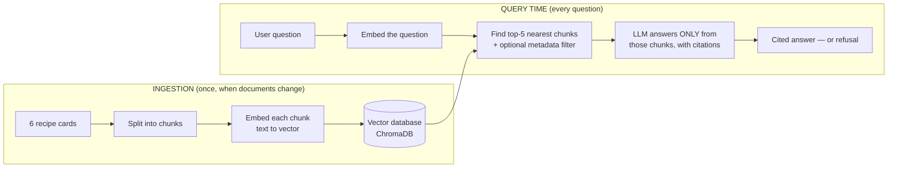

# How This Project Works — The Complete Explanation

*Week 3, Task Set B: a RAG (Retrieval-Augmented Generation) app over South
Indian fermented-food recipe cards. This document explains every part of it
in plain language — read it top to bottom and you'll be able to explain the
whole project to anyone.*

---

## 1. What this project is, in one paragraph

An AI language model (like ChatGPT or Gemini) has never read our 6 recipe
cards, so if you ask it "how much rock salt goes in the idli batter?", it
will *invent* a plausible-sounding number — because language models don't
look facts up, they predict likely text. This project fixes that: we store
the recipe cards in a searchable index, and when a question comes in, we
**find the relevant paragraphs first** and force the model to answer **only
from them**, citing exactly which paragraph each fact came from — or to say
"I cannot find this in the recipe cards" when the answer genuinely isn't
there. That architecture is called **RAG: Retrieval-Augmented Generation**.

---

## 2. The big picture

There are two separate moments in a RAG system:



Everything in this project is one of those boxes. Let's go through them.

---

## 3. The data: 6 recipe cards

Each card in `data/new_cards/` is a markdown file with two parts:

**The frontmatter** (between `---` lines) — labels *about* the recipe:

```yaml
recipe_id: idli-batter-01
title: Idli Batter (2kg batch)
cuisine: tamil
dietary_tags: vegan, gluten-free
```

**The body** — the actual content, always in three sections: an ingredient
table (`## Ingredients`), cooking instructions (`## Method`), and an
`## Allergen note`.

The 6 recipes: idli batter, dosa batter, appam, thayir (curd), ragi koozh,
and kadumanga achar (fermented mango pickle). They were chosen to make the
experiment meaningful: idli and dosa are near-twins (stress test for
retrieval), three cards contain different salt weights (20g / 18g / 7g —
confusion risk), only thayir is non-vegan (makes filtering visible), and
kadumanga is NOT gluten-free despite looking like it (the trap question).

---

## 4. Chunking — the heart of the assignment

**Why split documents at all?** Two reasons. First, we can't paste all
documents into the model's prompt — we pay per token and the context window
is finite. Second, one embedding representing a whole document is a blurry
average of many topics; an embedding of one focused paragraph is sharp.

A **chunk** is the unit of retrieval: what gets embedded, stored, and
returned. If chunks are cut badly, search returns the wrong ones, and no
smarter model downstream can fix that.

This project compares two cutting strategies (`chunkers.py`):

### Strategy 1: naive (the "current" chunker)

Cut every 400 characters, overlap 50 characters between neighbours.
Completely blind to structure — a cut can land in the middle of a table row.

Real damage we observed: it produced a chunk from the appam card that starts
mid-row — `"0g | 20% | | Sugar | 15g..."` — a table fragment with **no recipe
title attached**. It also sliced a 12-character chunk off the thayir card
whose entire content is `"Gluten-free."` — a meaningless shred.

### Strategy 2: structure-aware

Cut at markdown section boundaries (`## Ingredients`, `## Method`, ...)
following two rules:

1. **Never split a table** — the whole ingredient table travels together, so
   "20g rock salt" always sits beside its header and its recipe.
2. **Stamp every chunk with the recipe title** — no chunk is ever an orphan.

Both strategies were indexed side by side (collections `recipes_naive` and
`recipes_structure`), which is what makes a fair comparison possible.

---

## 5. Embeddings and the vector database

An **embedding** turns text into a list of 384 numbers (a *vector*) such
that texts with similar *meaning* get similar numbers. "How much salt?" and
"| Rock salt | 20g |" land near each other in that 384-dimensional space
even though they share almost no words.

This project uses ChromaDB's built-in embedding model (all-MiniLM-L6-v2),
which runs **locally on this machine — free, offline, no API key**. The
vectors live in a persistent ChromaDB database in `chroma_db/`.

**Searching** = embed the question with the *same* model, then find the
chunks whose vectors are nearest (cosine similarity: 1.0 = identical
meaning, 0 = unrelated). We take the top 5 — that's "top-K retrieval" with
K=5.

One rule that must never be broken: the same model embeds the chunks and
the questions. Vectors from different models are not comparable.

---

## 6. Metadata: the labels riding on every chunk

Every chunk is stored with labels from its card's frontmatter:
`source_file`, `recipe_id`, `title`, `cuisine`, `dietary_tags`. The task
declares a chunk without `source_file` a *failed ingest* — so `ingest.py`
literally `assert`s it on every chunk.

**A subtlety worth knowing:** ChromaDB filters match whole values only, so
`"vegan" == "vegan, gluten-free"` fails. The fix in `ingest.py`: expand tags
into boolean fields (`tag_vegan=True`, `tag_gluten_free=True`) and filter on
those.

**Why filtering matters — the demo that proves it.** For the query *"which
fermented dish is safe for someone who cannot eat gluten?"*, the unfiltered
top result was the **kadumanga pickle — which is NOT gluten-free** (its
asafoetida contains wheat). It ranked first *because* its allergen note
discusses gluten at length. Similarity search matches *topic*, not *truth*.
Adding the filter `tag_gluten_free=True` removed it and put ragi koozh on
top. This is the difference between "sounds relevant" and "is safe to
recommend" — for dietary questions, that's a safety issue, not a nicety.

---

## 7. The experiment: measuring, not eyeballing

You cannot judge a chunker by reading its output and saying "looks better" —
the task gives that zero marks. You need a number. Here's how we made one:

1. **Write 8 questions FIRST**, from the cards, before running any searches
   (`questions.md` / `questions.json`). Each has a known answer you can
   point to by recipe and section. At least 3 must depend on an
   ingredient-table row (ours: 4 of 8). Writing questions *after* seeing
   search results would measure your question-writing, not your chunker.
2. **Freeze them.** No rewording after seeing results.
3. **Define "hit" before measuring:** a top-5 chunk whose `recipe_id`
   matches the expected recipe AND whose text contains the answer.
4. **Run all 8 against both indexes** (`measure.py`) and count.

**A real bug we caught here:** the answer string `"50g"` matches *inside*
`"250g"`, and `"20g"` inside `"~720g"` — so a chunk containing only the
wrong table row could score a fake hit. Fix: require a leading space
(`" 50g"`). Lesson: your measurement can lie to you; check it.

### The results

| Strategy | hit-in-top-5 | at rank 1 |
|---|---|---|
| naive | **8/8** | 6/8 |
| structure-aware | **8/8** | 6/8 |

**A tie — and the honest diagnosis is the most important paragraph in the
project.** The corpus is only 24 chunks, so top-5 covers 21% of everything:
the bar is too low to separate two decent chunkers. In a realistic corpus
(hundreds of chunks), today's rank differences become hit/miss differences.
Saying "8/8 vs 8/8, so chunking doesn't matter" would be the wrong
conclusion; "the metric saturated, and here's the evidence at rank level"
is the right one.

The rank-level evidence:

- **Naive's most embarrassing retrieval:** for "why isn't kadumanga
  gluten-free?", its #1 result was the 12-character orphan `"Gluten-free."`
  — pathologically keyword-dense, informationally empty. The correct chunk
  sat at rank 3.
- **Structure-aware's own flaw:** it emits tiny "intro stub" chunks (title +
  one sentence) that steal rank-1 on recipe-named queries (Q2, Q3). Fixable
  by merging the stub into the ingredients chunk — that's the *next* single
  change to measure, deliberately not bundled into this comparison (change
  two things at once and you learn nothing about which one moved the
  number).
- **The near-disaster on Q2:** for "how much fine sea salt in the appam?",
  structure-aware's #1 was the *dosa* table (18g!) with the right answer
  (7g) at rank 2. A generation step reading only the top chunk would have
  put the wrong salt in the wrong batter.

**Verdict: structure-aware ships** — not because of the tied number, but
because every chunk it returns is self-contained (title + intact table),
which is what the generation step needs. Naive's hits include headless
fragments that invite cross-recipe confusion as the corpus grows.

---

## 8. Grounded generation: citations and forced refusal

The final step (`ask.py`) is where the LLM (Gemini, via its free tier)
enters — and it's deliberately caged:

1. Retrieve the top-5 chunks for the question.
2. Put them in the prompt, each labelled with its `chunk_id`.
3. System prompt rules: **every claim must cite its chunk_id**; if the
   chunks don't contain the answer, reply with *exactly*
   `"I cannot find this in the recipe cards."` — and an unsupported answer
   is declared a failure, the refusal a success.
4. Temperature 0, so answers are repeatable.
5. After generation, `verify_citations()` programmatically checks every
   cited chunk_id actually exists in the index.

**Why "forced, not suggested" matters:** a prompt saying "if the context is
insufficient, use your best judgment" is exactly how an invented gram weight
ends up in someone's dough. The refusal sentence must be the *required*
behaviour, not a polite option.

**Results (all verbatim in `results/generation_transcripts.md`):**

- 3 answerable questions → 3 correct answers, every citation resolving to a
  real chunk that genuinely contains the claim.
- 3 impossible questions (calories, protein, fridge shelf-life — no card
  has nutrition or storage data) → 3 exact refusals. The shelf-life one was
  the riskiest: the corpus is full of fermentation *times*, and a weaker
  setup would have repurposed one as a storage time. It refused.

---

## 9. Every file, in one table

| File | Role |
|---|---|
| `data/new_cards/*.md` | The corpus: 6 recipe cards (frontmatter + body) |
| `chunkers.py` | Both cutting strategies — the experiment's subject |
| `ingest.py` | Cards → chunks → embeddings → ChromaDB, metadata on every chunk |
| `search.py` | Ask the index a question (top-K, optional `--tag` filter) — no LLM |
| `questions.md` / `.json` | The 8 frozen questions + the hit criterion |
| `measure.py` | Runs 8 questions × 2 strategies, produces the two numbers |
| `ask.py` | Grounded generation: citations + forced refusal (needs API key) |
| `transcripts.py` | Runs the 3 + 3 generation tests, saves transcripts |
| `results.md` | **The submission document** — all evidence assembled |
| `results/search_dump.md` | Full top-5 lists for all 8 questions, both strategies |
| `results/generation_transcripts.md` | The 6 generation transcripts, verbatim |
| `results/chunker_diff.patch` | Literal git diff of the commit adding chunker #2 |
| `.env` (git-ignored!) | API keys — never committed, never shared |

---

## 10. How to run everything

```powershell
cd "d:\AI Learning\week3-rag"
.venv\Scripts\Activate.ps1

python ingest.py --strategy naive        # index under chunker 1
python ingest.py --strategy structure    # index under chunker 2
python measure.py                        # the two hit-in-top-5 numbers
python search.py "how much salt in idli batter?" --strategy structure
python search.py "gluten free dish?" --strategy structure --tag gluten-free
python ask.py "How much rock salt goes into the 2kg batch of idli batter?"
python transcripts.py                    # the 3 cited answers + 3 refusals
```

Only the last two need an API key (generation). Everything else — chunking,
embedding, search, the whole measurement — runs locally and free.

---

## 11. Questions a mentor might ask (and honest answers)

**Q: Why not just use a smarter model instead of all this?**
Because if retrieval fetches the wrong chunk, the smartest model in the
world answers from the wrong text. Retrieval quality is upstream of
everything; that's also why Week 4 is entirely about debugging it.

**Q: Who computes what, where?**
Embeddings: a small local model on this machine, free. Retrieval: ChromaDB,
local. Only the final answer-writing calls a cloud LLM (Gemini). And in tool
terms from Week 2: the LLM never touches the database — our code retrieves,
the LLM only reads what we hand it.

**Q: Why did your two numbers tie, and is that a failed experiment?**
Corpus too small for the metric: top-5 out of 24 chunks is a 21% net. Not
failed — the per-question ranks and retrieved text show the difference the
headline number can't. Knowing *why* a metric saturated is the skill being
taught.

**Q: What was your embarrassing retrieval?**
Naive's rank-1 for the gluten question: a chunk whose entire content is
`"Gluten-free."` — 12 characters sliced off an unrelated card, outranking
the true answer through sheer keyword density.

**Q: How do you know the citations are real?**
Programmatically: every `[chunk_id]` in an answer is looked up in the index
(`verify_citations()`), and the graded transcripts show each cited chunk
contains the claimed fact.

**Q: What would you change next?**
One thing at a time: merge the structure chunker's intro-stub into the
ingredients chunk, re-run the same 8 questions, compare. Then Week 4's
tools — hybrid keyword+semantic search and reranking — attack the remaining
rank-1 misses.

**Q: What are the limitations of this whole setup?**
Six self-authored cards (official Set B pack was unavailable — swapping it
in is a re-run, not a rewrite); a saturated headline metric; and refusal
tested on only 3 questions — a production system would test dozens.

---

## 12. Glossary

| Term | Plain meaning |
|---|---|
| **RAG** | Retrieve relevant text first, then generate the answer only from it |
| **Chunk** | One retrievable piece of a document |
| **Embedding** | A text's meaning encoded as a vector of numbers |
| **Vector database** | Storage that answers "which stored vectors are nearest to this one?" fast |
| **Cosine similarity** | The nearness score between two vectors (1.0 = same meaning) |
| **Top-K** | Return the K best matches (here K=5) |
| **Metadata filter** | A hard restriction on labels, applied inside the search |
| **hit-in-top-5** | Did the correct chunk appear in the top 5 results? Counted over known-answer questions |
| **Grounded generation** | The LLM may only use the retrieved chunks, never its own memory |
| **Forced refusal** | An exact "I don't know" sentence the model *must* use when the corpus lacks the answer |
| **Hallucination** | A model inventing plausible-but-false text — the failure this whole project exists to prevent |
